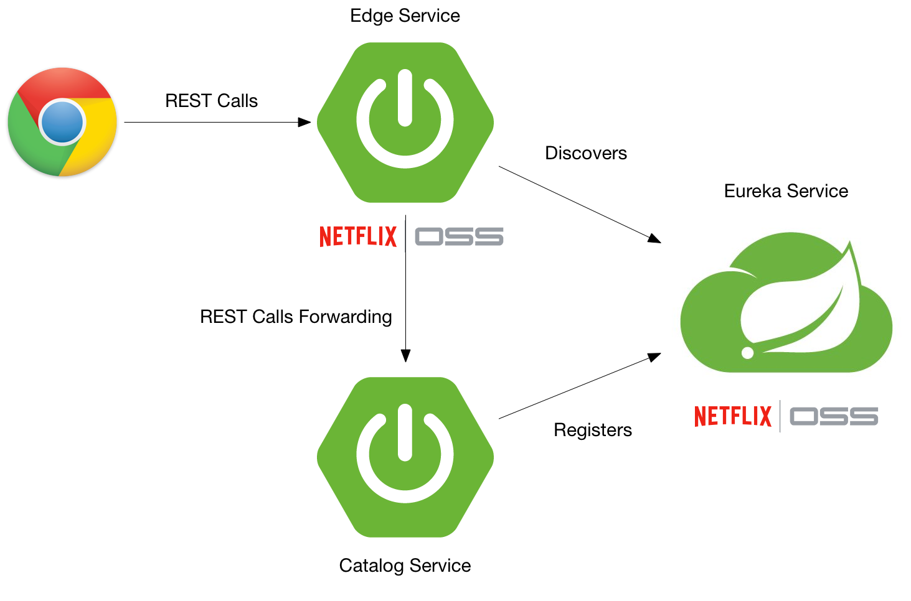
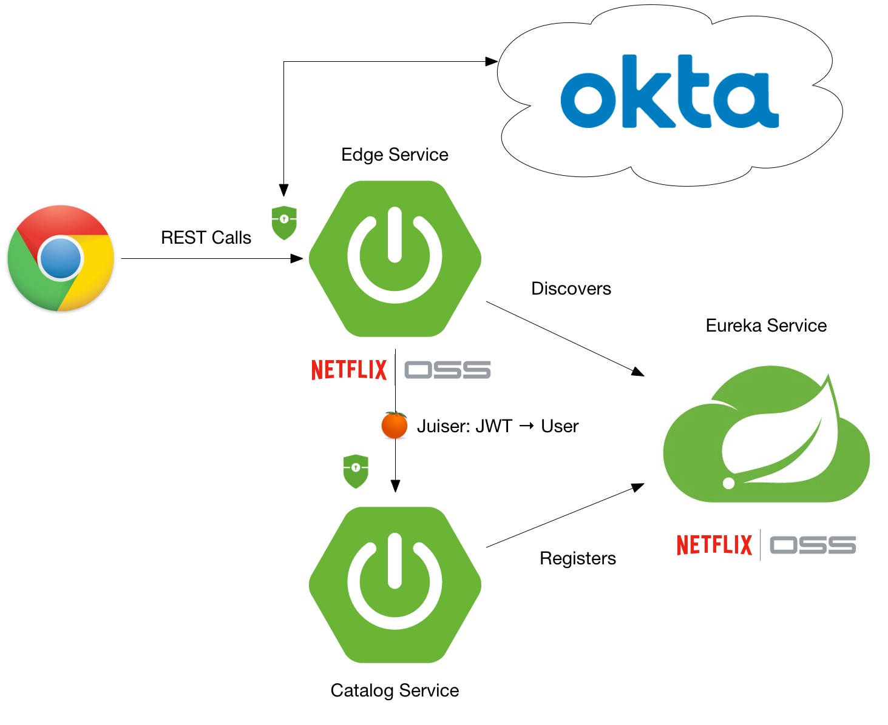

# Secure a Spring Microservices Architecture with Spring Security, JWTs, Juiser, and Okta

You've built a microservices architecture with Spring Boot and Spring Cloud. You're happy with the results, and you like 
how it adds resiliency to your application. You're also pleased with how it scales and how different teams can deploy 
microservices independently. But what about security? 

Are you using Spring Security to lock everything down? Are your microservices locked down too, or are they just behind 
the firewall? 

This tutorial shows you how you can use Spring Security, Okta, and a few Java libraries to secure your microservices 
architecture. Not only that, but I'll show you how to secure *everything*, so even your backend services communicate
securely. You'll learn how to use JWTs and [Juiser](https://github.com/juiser/juiser) to read an `X-Forwarded-User`
header and turn it into a Spring Security `User`.

This tutorial builds off [Build a Microservices Architecture for Microbrews with Spring Boot](/blog/2017/06/15/build-microservices-architecture-spring-boot). 
A simple microservices architecture with Spring Boot and Spring Cloud looks as follows.



Once you've completed this tutorial, you'll have Spring Security locking things down, and Okta providing authentication 
and JWT validation.



To begin, you'll need to clone the aforementioned article's completed project.

```bash
git clone https://github.com/oktadeveloper/spring-boot-microservices-example.git
```

[Create an Okta Developer account](https://github.com/stormpath/stormpath-sdk-java/blob/okta/OktaGettingStarted.md).
After completing these steps, you should have the information you need to set the following environment variables.

```bash
export STORMPATH_CLIENT_BASEURL=[base-url]
export OKTA_APPLICATION_ID=[application-id]
export OKTA_API_TOKEN=[api-token]
```

## Add Stormpath's Zuul Support to the Edge Service

The **edge-service** application handles the routing to the backend `beer-catalog-service`, so it's the best place to 
start securing things. Add the Stormpath BOM (Bill Of Materials) in the `dependencyManagement` section of 
`edge-service/pom.xml`.

```xml
<dependency>
    <groupId>com.stormpath.sdk</groupId>
    <artifactId>stormpath-bom</artifactId>
    <version>2.0.0-okta-rc3</version>
    <type>pom</type>
    <scope>import</scope>
</dependency>
```

Then add a dependency for Stormpath's Zuul integration.

```xml
<dependency>
    <groupId>com.stormpath.spring</groupId>
    <artifactId>stormpath-zuul-spring-cloud-starter</artifactId>
</dependency>
```

> **NOTE:** I'm using Stormpath libraries in this example. We plan to release Okta libraries that have this
same functionality soon. I'll make sure to update this post when the Okta Zuul support has been released.

Add the following properties and values to the project's `application.properties`.

```properties
server.use-forward-headers=true

zuul.routes.beer-catalog-service.path=/beers
zuul.routes.beer-catalog-service.url=http://localhost:8080

zuul.routes.home.path=/home
zuul.routes.home.url=http://localhost:8080

stormpath.web.cors.allowed.originUris=http://localhost:4200

stormpath.zuul.account.header.jwt.key.resource=classpath:rsatest.priv.pem
# this is just one example of a key id - anything that the origin server can make sense of to lookup
# the corresponding public key is fine.  Here we use the public key file name.
stormpath.zuul.account.header.jwt.key.id=rsatest.pub.pem
```

Copy the `rsatest.*` files from the [Stormpath Zuul example project](https://github.com/stormpath/stormpath-sdk-java/tree/master/examples/zuul-spring-cloud-starter/src/main/resources), 
or create new ones using the following. 

```bash
openssl genrsa -out rsatest.priv.pem 2048
```

Generate the private key's corresponding `rsatest.pub.pem` public key with:

```bash
openssl rsa -in rsatest.priv.pem -pubout > rsatest.pub.pem
```

After copying (or generating), both `rsatest.priv.pem` and `rsatest.pub.pem` files should be in 
`edge-service/src/main/resources`.

## Add Juiser to the Beer Catalog Service

[Juiser](https://github.com/juiser/juiser) is a small Java library that automates token authentication during an HTTP 
request. In this example, Juiser reads the `X-Forwarded-User` header and creates a Spring Security `User` for you.

For Juiser to read the JWT sent by Stormpath's Zuul support, you need to copy the public key (`rsatest.pub.pem`) from 
`edge-service/src/main/resources` to `beer-catalog-service/src/main/resources`. Then add the following dependencies to 
the Beer Catalog Service's `pom.xml`.

```xml
<properties>
    ...
    <bouncycastle.version>1.56</bouncycastle.version>
    <juiser.version>1.0.0</juiser.version>
</properties>

<dependencies>
    <dependency>
        <!-- To handle the X-Forwarded-User header: -->
        <groupId>org.juiser</groupId>
        <artifactId>juiser-spring-boot-starter</artifactId>
        <version>${juiser.version}</version>
    </dependency>
    <dependency>
        <!-- So juiser can read *.pem public key files to verify the signature of the JWT in the
             X-Forwarded-User header: -->
        <groupId>org.bouncycastle</groupId>
        <artifactId>bcpkix-jdk15on</artifactId>
        <version>${bouncycastle.version}</version>
        <scope>runtime</scope>
    </dependency>
    <dependency>
        <groupId>org.springframework.boot</groupId>
        <artifactId>spring-boot-starter-security</artifactId>
    </dependency>
    <dependency>
        <groupId>org.springframework.security</groupId>
        <artifactId>spring-security-config</artifactId>
    </dependency>
    <dependency>
        <groupId>org.springframework.security</groupId>
        <artifactId>spring-security-web</artifactId>
    </dependency>
    <dependency>
        <groupId>org.springframework.boot</groupId>
        <artifactId>spring-boot-starter-thymeleaf</artifactId>
    </dependency>
    ...
</dependencies>
```

Create a `HomeController` in `src/main/java/com/example/HomeController.java` to render the user's information so you can 
verify authentication is working.

```java
package com.example;

import org.juiser.model.User;
import org.springframework.stereotype.Controller;
import org.springframework.ui.Model;
import org.springframework.web.bind.annotation.GetMapping;
import org.springframework.web.bind.annotation.RequestMapping;

@Controller
public class HomeController {

    private final User user;

    public HomeController(User user) {
        this.user = user;
    }

    @RequestMapping("/home")
    public String howdy(Model model) {
        model.addAttribute("user", user);
        return "home";
    }
}
```

**NOTE:** There is an issue with Juiser 1.0.0 that it won't initialize  if you don't have at least one `@Controller` in 
your project.

Create a `home.html` template in `src/main/resources/templates/home.html` and populate it with the following code.

```html
<!DOCTYPE HTML>
<html xmlns:th="http://www.thymeleaf.org">
<head>
    <style>
        th {
            text-align: left;
        }
        td {
            white-space: nowrap;
        }
        td:first-child {
            font-family: "Courier", monospace;
            font-size: 0.9em;
            color: #343434;
        }
    </style>
</head>
<body>
<h1>Hello<span th:if="${user.authenticated}" th:text="' ' + ${user.givenName}"> Joe</span>!</h1>
<div th:unless="${user.authenticated}">
    <a th:href="@{/login}">Login</a>
</div>
<div th:if="${user.authenticated}">
    <form id="logoutForm" th:action="@{/logout}" method="post">
        <input type="submit" value="Logout"/>
    </form>
</div>

<h2>User Properties</h2>
<table>
    <thead>
    <tr>
        <th>Name</th>
        <th>Value</th>
    </tr>
    </thead>
    <tbody>
    <tr>
        <td>anonymous</td>
        <td th:text="${user.anonymous}"></td>
    </tr>
    <tr>
        <td>authenticated</td>
        <td th:text="${user.authenticated}"></td>
    </tr>
    <tr>
        <td>href</td>
        <td th:text="${user.href}"></td>
    </tr>
    <tr>
        <td>id</td>
        <td th:text="${user.id}"></td>
    </tr>
    <tr>
        <td>name</td>
        <td th:text="${user.name}"></td>
    </tr>
    <tr>
        <td>givenName</td>
        <td th:text="${user.givenName}"></td>
    </tr>
    <tr>
        <td>middleName</td>
        <td th:text="${user.middleName}"></td>
    </tr>
    <tr>
        <td>familyName</td>
        <td th:text="${user.familyName}"></td>
    </tr>
    <tr>
        <td>nickname</td>
        <td th:text="${user.nickname}"></td>
    </tr>
    <tr>
        <td>username</td>
        <td th:text="${user.username}"></td>
    </tr>
    <tr>
        <td>profile</td>
        <td th:text="${user.profile}"></td>
    </tr>
    <tr>
        <td>picture</td>
        <td th:text="${user.picture}"></td>
    </tr>
    <tr>
        <td>website</td>
        <td th:text="${user.website}"></td>
    </tr>
    <tr>
        <td>email</td>
        <td th:text="${user.email}"></td>
    </tr>
    <tr>
        <td>emailVerified</td>
        <td th:text="${user.emailVerified}"></td>
    </tr>
    <tr>
        <td>gender</td>
        <td th:text="${user.gender}"></td>
    </tr>
    <tr>
        <td>birthdate</td>
        <td th:text="${user.birthdate}"></td>
    </tr>
    <tr>
        <td>zoneInfo</td>
        <td th:text="${user.zoneInfo}"></td>
    </tr>
    <tr>
        <td>phoneNumber</td>
        <td th:text="${user.phone}"></td>
    </tr>
    <tr>
        <td>phoneNumberVerified</td>
        <td th:text="${user.phoneNumberVerified}"></td>
    </tr>
    <tr>
        <td>createdAt</td>
        <td th:text="${user.createdAt}"></td>
    </tr>
    <tr>
        <td>updatedAt</td>
        <td th:text="${user.updatedAt}"></td>
    </tr>
    </tbody>
</table>
</body>
</html>
```

Add the following properties to `src/main/resources/application.properties` to configure Juiser.

```properties
server.use-forward-headers=true
juiser.header.jwt.key.resource=classpath:rsatest.pub.pem
```

Create a `SecurityConfig.java` class in the same package as `HomeController`. This class configures Spring Security so 
it secures all endpoints.

```java
package com.example;

import org.springframework.context.annotation.Configuration;
import org.springframework.security.config.annotation.web.builders.HttpSecurity;
import org.springframework.security.config.annotation.web.configuration.WebSecurityConfigurerAdapter;

@Configuration
public class SecurityConfig extends WebSecurityConfigurerAdapter {

    @Override
    protected void configure(HttpSecurity http) throws Exception {
        http.authorizeRequests().anyRequest().fullyAuthenticated();
    }
}
```

### Add RequestInterceptor for Feign

The `@FeignClient` used to talk to `beer-catalog-service` is not aware of the `X-Forwarded-User` header. To make it aware, 
create a `ForwardedAccountRequestInterceptor` class in the same directory as `EdgeServiceApplication`.

```java
package com.example;

import com.stormpath.sdk.servlet.http.Resolver;
import com.stormpath.zuul.account.ForwardedAccountHeaderFilter;
import feign.RequestInterceptor;
import feign.RequestTemplate;
import org.slf4j.Logger;
import org.slf4j.LoggerFactory;
import org.springframework.web.context.request.RequestContextHolder;
import org.springframework.web.context.request.ServletRequestAttributes;

import javax.servlet.http.HttpServletRequest;
import javax.servlet.http.HttpServletResponse;

public class ForwardedAccountRequestInterceptor implements RequestInterceptor {

    private static final Logger LOGGER = LoggerFactory.getLogger(ForwardedAccountRequestInterceptor.class);

    private final Resolver<String> valueResolver;

    public ForwardedAccountRequestInterceptor(Resolver<String> accountStringResolver) {
        this.valueResolver = accountStringResolver;
    }

    @Override
    public void apply(RequestTemplate template) {
        if (template.headers().containsKey(ForwardedAccountHeaderFilter.DEFAULT_HEADER_NAME)) {
            LOGGER.warn("The X-Forwarded-User has been already set");
        } else {
            LOGGER.debug("Constructing Header {} for Account", ForwardedAccountHeaderFilter.DEFAULT_HEADER_NAME);
            HttpServletRequest request = ((ServletRequestAttributes) RequestContextHolder.getRequestAttributes()).getRequest();
            HttpServletResponse response = ((ServletRequestAttributes) RequestContextHolder.getRequestAttributes()).getResponse();
            template.header(ForwardedAccountHeaderFilter.DEFAULT_HEADER_NAME, valueResolver.get(request, response));
        }
    }
}
```

Register it as a `@Bean` in `EdgeServiceApplication`.

```java
@Bean
public RequestInterceptor forwardedAccountRequestInterceptor(
        @Qualifier("stormpathForwardedAccountHeaderValueResolver") Resolver<String> accountStringResolver) {
    return new ForwardedAccountRequestInterceptor(accountStringResolver);
}
```

While you're modifying `EdgeServiceApplication`, change the `HystrixCommand` in `BeerController` to make Hystrix
[execute on the calling thread](http://stackoverflow.com/q/29566777/65681) (so it's aware of the security context).

```java
@HystrixCommand(fallbackMethod = "fallback", commandProperties = {
        @HystrixProperty(name="execution.isolation.strategy", value="SEMAPHORE")
})
```

### Verify Secure Communication

Verify communication between the `edge-service` and `beer-catalog-service` works by starting both applications
and navigating to `http://localhost:8081/home`. You should see a login page, prompting for your credentials.


After logging in, you should see a page displaying your user's information.


Click the **Logout** button to delete the cookies in your browser and end your session.

## Add Okta's Sign-In Widget to the Client

Install [Okta's Sign-In Widget](https://developer.okta.com/code/javascript/okta_sign-in_widget) to make it possible to communicate with the secured server.

```bash
cd client
npm install @okta/okta-signin-widget --save
```

Create `client/src/app/shared/okta/okta.service.ts` and use it to configure the widget to talk to your Okta instance.

```typescript
import { Injectable } from '@angular/core';
import * as OktaSignIn from '@okta/okta-signin-widget/dist/js/okta-sign-in.min.js'
import { ReplaySubject } from 'rxjs/ReplaySubject';
import { Observable } from 'rxjs/Observable';

@Injectable()
export class OktaAuthService {

  signIn = new OktaSignIn({
    baseUrl: 'https://{yourOktaDomain}',
    clientId: '{clientId}',
    authParams: {
      issuer: 'https://{yourOktaDomain}',
      responseType: ['id_token', 'token'],
      scopes: ['openid', 'email', 'profile']
    }
  });

  public user$: Observable<any>;
  public userSource: ReplaySubject<any>;

  constructor() {
    this.userSource = new ReplaySubject<any>(1);
    // create an observable that can be subscribed to for user events
    this.user$ = this.userSource.asObservable();
  }

  isAuthenticated() {
    // Checks if there is a current accessToken in the TokenManger.
    return !!this.signIn.tokenManager.get('accessToken');
  }

  login() {
    // Launches the widget and stores the tokens.
    this.signIn.renderEl({el: '#okta-signin-container'}, response => {
      if (response.status === 'SUCCESS') {
        response.forEach(token => {
          if (token.idToken) {
            this.signIn.tokenManager.add('idToken', token);
          }
          if (token.accessToken) {
            this.signIn.tokenManager.add('accessToken', token);
          }
          this.userSource.next(this.idTokenAsUser);
          this.signIn.hide();
        });
      } else {
        console.error(response);
      }
    });
  }

  get idTokenAsUser() {
    const token = this.signIn.tokenManager.get('idToken');
    return {
      name: token.claims.name,
      email: token.claims.email,
      username: token.claims.preferred_username
    }
  }

  async logout() {
    // Terminates the session with Okta and removes current tokens.
    this.signIn.tokenManager.clear();
    await this.signIn.signOut();
    this.signIn.remove();
    this.userSource.next(undefined);
  }
}
```

Make sure to replace `{yourOktaDomain}` and `{client}` in the above code.

Modify `client/src/app/shared/beer/beer.service.ts` to read the access token and set it in an `Authorization` header when 
it exists. 

```typescript
import { Injectable } from '@angular/core';
import { Http, Headers, RequestOptions, Response } from '@angular/http';
import 'rxjs/add/operator/map';
import { Observable } from 'rxjs';
import { OktaAuthService } from '../okta/okta.service';

@Injectable()
export class BeerService {

  constructor(private http: Http, private oktaService: OktaAuthService) {
  }

  getAll(): Observable<any> {
    const headers: Headers = new Headers();
    if (this.oktaService.isAuthenticated()) {
      const accessToken = this.oktaService.signIn.tokenManager.get('accessToken');
      headers.append('Authorization', accessToken.tokenType + ' ' + accessToken.accessToken);
    }
    const options = new RequestOptions({ headers: headers });
    return this.http.get('http://localhost:8081/good-beers', options)
      .map((response: Response) => response.json());
  }
}
```

Modify `app.component.html` to add a placeholder for the widget and a section to show the user’s name and a logout button.

```html
<md-toolbar color="primary">
  <span>{{title}}</span>
</md-toolbar>

<!-- Container to inject the Sign-In Widget -->
<div id="okta-signin-container"></div>

<div *ngIf="user">
  <h2>
    Welcome {{user?.name}}!
  </h2>

  <button md-raised-button (click)="oktaService.logout()">Logout</button>
</div>
<md-progress-bar mode="indeterminate" *shellRender></md-progress-bar>
<div [hidden]="!user" *shellNoRender>
  <app-beer-list></app-beer-list>
</div>
```

You’ll notice the `user` variable in the HTML. To resolve this, you need to change your `AppComponent`, so it 1) shows
the login or converts the token on initial load and 2) subscribes to changes in the `user$` observable from `OktaAuthService`.

```typescript
import { ChangeDetectorRef, Component, OnInit } from '@angular/core';
import { OktaAuthService } from './shared/okta/okta.service';

@Component({
  selector: 'app-root',
  templateUrl: './app.component.html',
  styleUrls: ['./app.component.css'],
})
export class AppComponent implements OnInit {
  title = 'app works!';
  user;

  constructor(public oktaService: OktaAuthService, private changeDetectorRef: ChangeDetectorRef) {
  }

  ngOnInit() {
    // 1. for initial load and browser refresh
    if (this.oktaService.isAuthenticated()) {
      this.user = this.oktaService.idTokenAsUser;
    } else {
      this.oktaService.login();
    }

    // 2. register a listener for authentication and logout
    this.oktaService.user$.subscribe(user => {
      this.user = user;
      if (!user) {
        this.oktaService.login();
      }
      // Let Angular know that model changed.
      // See https://github.com/okta/okta-signin-widget/issues/268 for more info.
      this.changeDetectorRef.detectChanges();
    });
  }
}
```

Okta's Sign-In Widget ships with CSS that make it looks good out-of-the-box. To use them in your application, modify 
 `client/src/styles.css` to have the following two imports. 

```css
@import '~@okta/okta-signin-widget/dist/css/okta-sign-in.min.css';
@import '~@okta/okta-signin-widget/dist/css/okta-theme.css';
```

### Verify Authentication Works

Navigate to <http://localhost:4200>, and you should see a login form like the following. 


**NOTE:** If it logs you in automatically, this is likely because you have cookies for `http://localhost:8080` still in 
your browser. Clear your cookies, or try an incognito window.

If you want to adjust the style of the form, so it isn't right up against the top toolbar, add the following to `styles.css`.

```css
#okta-signin-container {
  margin-top: 25px;
}
```


You should be able to log in, see a welcome message, as well as a logout button.

 

#### Fixing the Remember Me checkbox in 2.1.0

You might notice on the login form that it has a line for "Remember Me", but no checkbox. This is a [bug](https://github.com/okta/okta-signin-widget/pull/248) and will be fixed in a future release. As a workaround, you can do two things:

1. Copy the image into your project and add its directory as an asset.
2. Disable the Remember Me feature.

To copy the image into your project, run the following commands to create a directory and copy the image into it.

```bash
cd client
mkdir -p src/img/ui/forms
cp node_modules/@okta/okta-signin-widget/dist/img/ui/forms/checkbox-sign-in-widget@2x.png src/img/ui/forms/.
```

You'll also need to update `client/.angular-cli.json` to include the `img` directory.

```json
"assets": [
  "assets",
  "img",
  "favicon.ico",
  "sw.js"
],
```

If you'd rather disable Remember Me, update `client/src/app/shared/okta/okta.service.ts` to turn it off using a 
[feature flag](https://developer.okta.com/code/javascript/okta_sign-in_widget_ref#feature-flags).

```typescript
signIn = new OktaSignIn({
  baseUrl: 'https://dev-158606.oktapreview.com',
  clientId: 'MjlYvTtFW26gOoOAHKOz',
  authParams: {
    issuer: 'https://dev-158606.oktapreview.com',
    responseType: ['id_token', 'token'],
    scopes: ['openid', 'email', 'profile']
  },
  features: {
    rememberMe: false
  }
});
```

## Learn More

The source code for this tutorial is [available on GitHub](https://github.com/oktadeveloper/spring-boot-microservices-example/), 
in the ["okta" branch](https://github.com/oktadeveloper/spring-boot-microservices-example/tree/okta).

```bash
git clone https://github.com/oktadeveloper/spring-boot-microservices-example.git
git checkout okta
```

Learn more about Okta and its APIs at [developer.okta.com](http://developer.okta.com). If you have questions about this 
tutorial, please hit me up on Twitter [@mraible](https://twitter.com/mraible) or post a question to the 
[Okta Developer Forums](https://devforum.okta.com).