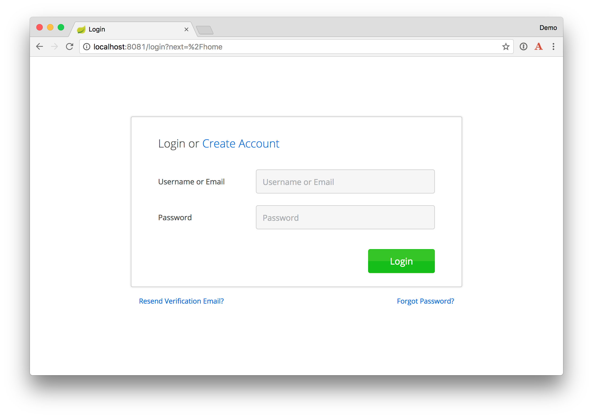
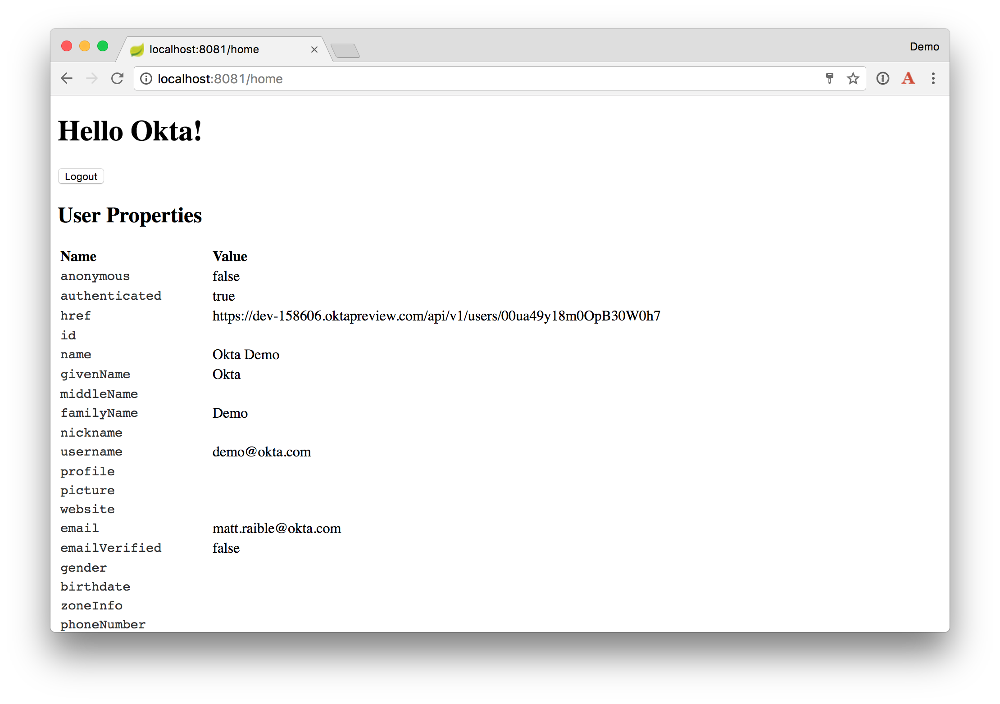
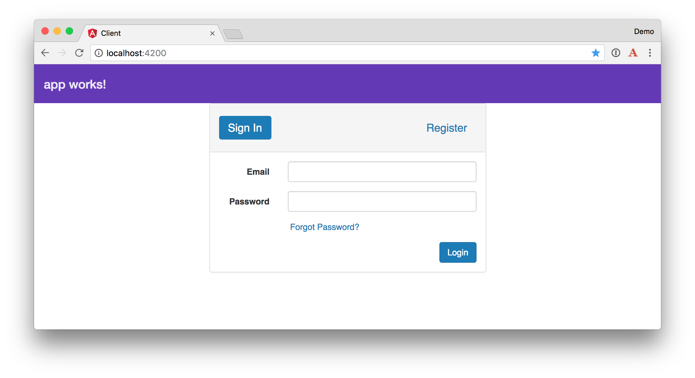
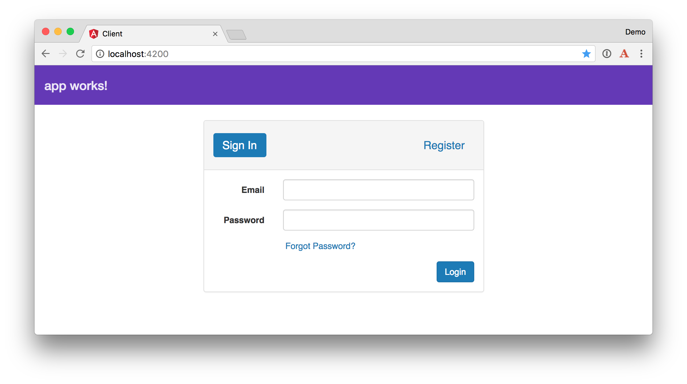
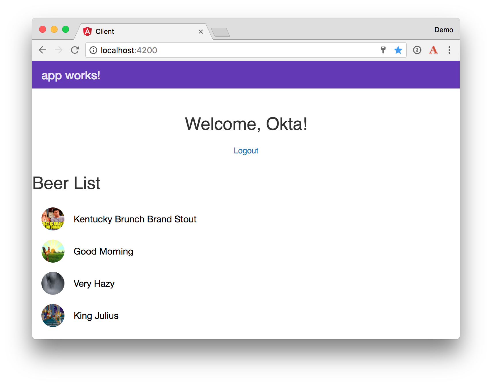

# Securing a Microservices Architecture with Okta

If you've built your microservices architecture with Spring Boot and Spring Cloud, you can easily lock it down using
Okta, Stormpath SDK's, JWTs, and [Juiser](https://github.com/juiser/juiser).

This tutorial assumes you've built a microservices architecture and an Angular app using [Building a Microservices Architecture for Microbrews](./TUTORIAL.md).
At the very least, you'll need to clone the aforementioned article's completed project.

```bash
git clone https://github.com/oktadeveloper/spring-boot-microservices-example.git
```

To begin, you'll need to [create an Okta Developer account](https://github.com/stormpath/stormpath-sdk-java/blob/okta/OktaGettingStarted.md).
After completing these steps, you should have the information you need to set the following environment variables.

```bash
export STORMPATH_CLIENT_BASEURL=[base-url]
export OKTA_APPLICATION_ID=[application-id]
export OKTA_API_TOKEN=[api-token]
```

## Add Stormpath's Zuul Support to the Edge Service

The **edge-service** application handles the routing to the backend beer-catalog-service, so its the best place to start securing things.
Add the Stormpath BOM (Bill Of Materials) in the `dependencyManagement` section of `edge-service/pom.xml`.

```xml
<dependency>
    <groupId>com.stormpath.sdk</groupId>
    <artifactId>stormpath-bom</artifactId>
    <version>2.0.0-okta-rc1</version>
    <type>pom</type>
    <scope>import</scope>
</dependency>
```

Then add a dependency for Stormpath's Zuul integration.

```xml
<dependency>
    <groupId>com.stormpath.spring</groupId>
    <artifactId>stormpath-zuul-spring-cloud-starter</artifactId>
</dependency>
```

Add the following properties and values to the project's `application.properties`.

```properties
server.use-forward-headers=true

zuul.routes.beer-catalog-service.path=/beers
zuul.routes.beer-catalog-service.url=http://localhost:8080

zuul.routes.home.path=/home
zuul.routes.home.url=http://localhost:8080

stormpath.web.cors.allowed.originUris=http://localhost:4200

stormpath.zuul.account.header.jwt.key.resource=classpath:rsatest.priv.pem
# this is just one example of a key id - anything that the origin server can make sense of to lookup
# the corresponding public key is fine.  Here we use the public key file name.
stormpath.zuul.account.header.jwt.key.id=rsatest.pub.pem
```

Copy the `rsatest.*` files from the [Stormpath Zuul example project](https://github.com/stormpath/stormpath-sdk-java/tree/master/examples/zuul-spring-cloud-starter/src/main/resources), 
or create new ones using the following. 

```bash
openssl genrsa -out rsatest.priv.pem 2048
```

Generate the private key's corresponding `rsatest.pub.pem` public key with:

```bash
openssl rsa -in rsatest.priv.pem -pubout > rsatest.pub.pem
```

After copying (or generating), both `rsatest.priv.pem` and `rsatest.pub.pem` files should be in `edge-service/src/main/resources`.

## Add Juiser to the Beer Catalog Service

[Juiser](https://github.com/juiser/juiser) is a small Java library that automates token authentication during an HTTP request. In this example, Juiser
 reads the `X-Forwarded-User` header and creates a Spring Security `User` object for you.

In order for Juiser to read the JWT sent by Stormpath's Zuul support, you'll need to copy the public key (`rsatest.pub.pem`) from 
`edge-service/src/main/resources` to `beer-catalog-service/src/main/resources`. Then add the following dependencies to the 
Beer Catalog Service's `pom.xml`.

```xml
<properties>
    ...
    <bouncycastle.version>1.56</bouncycastle.version>
    <juiser.version>1.0.0</juiser.version>
</properties>

<dependencies>
    <dependency>
        <!-- To handle the X-Forwarded-User header: -->
        <groupId>org.juiser</groupId>
        <artifactId>juiser-spring-boot-starter</artifactId>
        <version>${juiser.version}</version>
    </dependency>
    <dependency>
        <!-- So juiser can read *.pem public key files to verify the signature of the JWT in the
             X-Forwarded-User header: -->
        <groupId>org.bouncycastle</groupId>
        <artifactId>bcpkix-jdk15on</artifactId>
        <version>${bouncycastle.version}</version>
        <scope>runtime</scope>
    </dependency>
    <dependency>
        <groupId>org.springframework.boot</groupId>
        <artifactId>spring-boot-starter-security</artifactId>
    </dependency>
    <dependency>
        <groupId>org.springframework.security</groupId>
        <artifactId>spring-security-config</artifactId>
    </dependency>
    <dependency>
        <groupId>org.springframework.security</groupId>
        <artifactId>spring-security-web</artifactId>
    </dependency>
    <dependency>
        <groupId>org.springframework.boot</groupId>
        <artifactId>spring-boot-starter-thymeleaf</artifactId>
    </dependency>
    ...
</dependencies>
```

Create a `HomeController` in `src/main/java/com/example/HomeController.java` to render the user's information
so you can verify authentication is working.

```java
package com.example;

import org.juiser.model.User;
import org.springframework.stereotype.Controller;
import org.springframework.ui.Model;
import org.springframework.web.bind.annotation.GetMapping;
import org.springframework.web.bind.annotation.RequestMapping;

@Controller
public class HomeController {

    private final User user;

    public HomeController(User user) {
        this.user = user;
    }

    @RequestMapping("/home")
    public String howdy(Model model) {
        model.addAttribute("user", user);
        return "home";
    }
}
```

**NOTE:** There is an issue with Juiser 1.0.0 that it won't initialize properly if you don't have at least one `@Controller` in your project.

Create a `home.html` template in `src/main/resources/templates/home.html` and populate it with the following code.

```html
<!DOCTYPE HTML>
<html xmlns:th="http://www.thymeleaf.org">
<head>
    <style>
        th {
            text-align: left;
        }
        td {
            white-space: nowrap;
        }
        td:first-child {
            font-family: "Courier", monospace;
            font-size: 0.9em;
            color: #343434;
        }
    </style>
</head>
<body>
<h1>Hello<span th:if="${user.authenticated}" th:text="' ' + ${user.givenName}"> Joe</span>!</h1>
<div th:unless="${user.authenticated}">
    <a th:href="@{/login}">Login</a>
</div>
<div th:if="${user.authenticated}">
    <form id="logoutForm" th:action="@{/logout}" method="post">
        <input type="submit" value="Logout"/>
    </form>
</div>

<h2>User Properties</h2>
<table>
    <thead>
    <tr>
        <th>Name</th>
        <th>Value</th>
    </tr>
    </thead>
    <tbody>
    <tr>
        <td>anonymous</td>
        <td th:text="${user.anonymous}"></td>
    </tr>
    <tr>
        <td>authenticated</td>
        <td th:text="${user.authenticated}"></td>
    </tr>
    <tr>
        <td>href</td>
        <td th:text="${user.href}"></td>
    </tr>
    <tr>
        <td>id</td>
        <td th:text="${user.id}"></td>
    </tr>
    <tr>
        <td>name</td>
        <td th:text="${user.name}"></td>
    </tr>
    <tr>
        <td>givenName</td>
        <td th:text="${user.givenName}"></td>
    </tr>
    <tr>
        <td>middleName</td>
        <td th:text="${user.middleName}"></td>
    </tr>
    <tr>
        <td>familyName</td>
        <td th:text="${user.familyName}"></td>
    </tr>
    <tr>
        <td>nickname</td>
        <td th:text="${user.nickname}"></td>
    </tr>
    <tr>
        <td>username</td>
        <td th:text="${user.username}"></td>
    </tr>
    <tr>
        <td>profile</td>
        <td th:text="${user.profile}"></td>
    </tr>
    <tr>
        <td>picture</td>
        <td th:text="${user.picture}"></td>
    </tr>
    <tr>
        <td>website</td>
        <td th:text="${user.website}"></td>
    </tr>
    <tr>
        <td>email</td>
        <td th:text="${user.email}"></td>
    </tr>
    <tr>
        <td>emailVerified</td>
        <td th:text="${user.emailVerified}"></td>
    </tr>
    <tr>
        <td>gender</td>
        <td th:text="${user.gender}"></td>
    </tr>
    <tr>
        <td>birthdate</td>
        <td th:text="${user.birthdate}"></td>
    </tr>
    <tr>
        <td>zoneInfo</td>
        <td th:text="${user.zoneInfo}"></td>
    </tr>
    <tr>
        <td>phoneNumber</td>
        <td th:text="${user.phone}"></td>
    </tr>
    <tr>
        <td>phoneNumberVerified</td>
        <td th:text="${user.phoneNumberVerified}"></td>
    </tr>
    <tr>
        <td>createdAt</td>
        <td th:text="${user.createdAt}"></td>
    </tr>
    <tr>
        <td>updatedAt</td>
        <td th:text="${user.updatedAt}"></td>
    </tr>
    </tbody>
</table>
</body>
</html>
```

Add the following properties to `src/main/resources/application.properties` to configure Juiser.
```
server.use-forward-headers=true
juiser.header.jwt.key.resource=classpath:rsatest.pub.pem
```

Create a `SecurityConfig.java` class in the same package as `HomeController`. This class configures 
Spring Security so it secures all endpoints.

```java
package com.example;

import org.springframework.context.annotation.Configuration;
import org.springframework.security.config.annotation.web.builders.HttpSecurity;
import org.springframework.security.config.annotation.web.configuration.WebSecurityConfigurerAdapter;

@Configuration
public class SecurityConfig extends WebSecurityConfigurerAdapter {

    @Override
    protected void configure(HttpSecurity http) throws Exception {
        http.authorizeRequests().anyRequest().fullyAuthenticated();
    }
}
```

### Add RequestInterceptor for Feign

The `@FeignClient` used to talk to `beer-catalog-service` is not aware of the `X-Forwarded-User` header. To make it aware, 
create a `ForwardedAccountRequestInterceptor` class in the same directory as `EdgeServiceApplication`.

```java
package com.example;

import com.stormpath.sdk.servlet.http.Resolver;
import com.stormpath.zuul.account.ForwardedAccountHeaderFilter;
import feign.RequestInterceptor;
import feign.RequestTemplate;
import org.slf4j.Logger;
import org.slf4j.LoggerFactory;
import org.springframework.web.context.request.RequestContextHolder;
import org.springframework.web.context.request.ServletRequestAttributes;

import javax.servlet.http.HttpServletRequest;
import javax.servlet.http.HttpServletResponse;

public class ForwardedAccountRequestInterceptor implements RequestInterceptor {

    private static final Logger LOGGER = LoggerFactory.getLogger(ForwardedAccountRequestInterceptor.class);

    private final Resolver<String> valueResolver;

    public ForwardedAccountRequestInterceptor(Resolver<String> accountStringResolver) {
        this.valueResolver = accountStringResolver;
    }

    @Override
    public void apply(RequestTemplate template) {
        if (template.headers().containsKey(ForwardedAccountHeaderFilter.DEFAULT_HEADER_NAME)) {
            LOGGER.warn("The X-Forwarded-User has been already set");
        } else {
            LOGGER.debug("Constructing Header {} for Account", ForwardedAccountHeaderFilter.DEFAULT_HEADER_NAME);
            HttpServletRequest request = ((ServletRequestAttributes) RequestContextHolder.getRequestAttributes()).getRequest();
            HttpServletResponse response = ((ServletRequestAttributes) RequestContextHolder.getRequestAttributes()).getResponse();
            template.header(ForwardedAccountHeaderFilter.DEFAULT_HEADER_NAME, valueResolver.get(request, response));
        }
    }
}
```

Register it as a `@Bean` in `EdgeServiceApplication`.

```java
@Bean
public RequestInterceptor forwardedAccountRequestInterceptor(
        @Qualifier("stormpathForwardedAccountHeaderValueResolver") Resolver<String> accountStringResolver) {
    return new ForwardedAccountRequestInterceptor(accountStringResolver);
}
```

While you're modifying `EdgeServiceApplication`, change the `HystrixCommand` in `BeerController` to make Hystrix
[execute on the calling thread](http://stackoverflow.com/q/29566777/65681) (so it's aware of the security context).

```java
@HystrixCommand(fallbackMethod = "fallback", commandProperties = {
        @HystrixProperty(name="execution.isolation.strategy", value="SEMAPHORE")
})
```

### Verify Secure Communication

Verify communication between the `edge-service` and `beer-catalog-service` works by starting both applications
and navigating to `http://localhost:8081/home`. You should see a login page, prompting for your credentials.



After logging in, you should see a page display your user's information.



Click the **Logout** button to delete the cookies in your browser and end your session.

## Add Stormpath's Angular Support to the Client

Install Stormpath's Angular SDK to make it possible to communicate with the secured server.

```bash
npm install --save angular-stormpath
```

Modify `app.module.ts` to import `StormpathConfiguration` and `StormpathModule`. Then create a function to configure 
the endpointPrefix to point to `http://localhost:8081`. This function also configures the Angular SDK so it passes
an `Authorization` header to any endpoint that matches `http://localhost:8081/*`. 

```typescript
import { StormpathConfiguration, StormpathModule } from 'angular-stormpath';
 
export function stormpathConfig(): StormpathConfiguration {
  let spConfig: StormpathConfiguration = new StormpathConfiguration();
  spConfig.endpointPrefix = 'http://localhost:8081';
  spConfig.autoAuthorizedUris.push(new RegExp(spConfig.endpointPrefix + '/*'));
  return spConfig;
}
```

In this same file, add `StormpathModule` to the imports in `@NgModule` and use the `stormpathConfig` function to override the default `
StormpathConfiguration` in the providers list.

```typescript
@NgModule({
  …
  imports: [
    ...
    StormpathModule
  ],
  providers: [
    BeerService, GiphyService,
    { provide: StormpathConfiguration, useFactory: stormpathConfig },
  ],
  bootstrap: [AppComponent]
})
```

You can also modify `beer.service.ts` to read the `endpointPrefix` from `StormpathConfiguration`. This will allow you to change
your APIs location in a single file (`app.module.ts`), which is useful when deploying to production.

```typescript
import { StormpathConfiguration } from 'angular-stormpath';

@Injectable()
export class BeerService {

  constructor(private http: Http, private config: StormpathConfiguration) {
  }

  getAll(): Observable<any> {
    return this.http.get(this.config.endpointPrefix + '/good-beers')
      .map((response: Response) => response.json());
  }
}
```

Modify `app.component.html` to add the Stormpath `<sp-authport></sp-authport>` component and a section to show the user’s name and a logout link.

```html
<md-toolbar color="primary">
  <span>{{title}}</span>
</md-toolbar>

<sp-authport></sp-authport>

<div *ngIf="(user$ | async)" class="row text-center">
  <h2>
    Welcome, {{ ( user$ | async ).givenName }}!
  </h2>
  <ul class="nav nav-pills nav-stacked text-centered">
    <li role="presentation" (click)="logout(); false"><a href="#">Logout</a></li>
  </ul>
</div>
<md-progress-bar mode="indeterminate" *shellRender></md-progress-bar>
<div [hidden]="!(user$ | async)" *shellNoRender>
  <app-beer-list></app-beer-list>
</div>
```

You’ll notice the `user$` variable in the HTML. In order to resolve this, you need to change your `AppComponent` so it extends `AuthPortComponent`.

```typescript
import { AuthPortComponent } from 'angular-stormpath';
...
export class AppComponent extends AuthPortComponent {
```

Stormpath's Angular SDK uses Bootstrap classes in its HTML templates. To make the login component look good, install Bootstrap.

```bash
npm install --save bootstrap@3.3.7
```

Then modify `.angular-cli.json` to add it to the styles array:

```json
"styles": [
  "../node_modules/bootstrap/dist/css/bootstrap.min.css",
  "styles.css"
],
```

### Verify Authentication Works

Navigate to <http://localhost:4200> and you should see a login form like the following. 



**NOTE:** If it logs you in automatically, this is probably because you have cookies for `http://localhost:8080` still 
in your browser. Clear your cookies, or try an incognito window.

If you want to adjust the style of the form so it isn't right up against the top toolbar, add the following to `styles.css`.

```css
sp-authport > .container {
  margin-top: 25px;
}
```



You should be able to login, see a welcome message, as well as a logout link. If the beer list doesn't load, it's likely
because it was already loaded when the app first loaded, and you need to load its data again after logging in.

### Listen for Login in BeerListComponent

Modify `beer-list.component.ts` so it uses the `Stormpath` service to listen for an authenticated user.

```typescript
import { Stormpath } from 'angular-stormpath';

@Component({
  selector: 'app-beer-list',
  templateUrl: './beer-list.component.html',
  styleUrls: ['./beer-list.component.css']
})
export class BeerListComponent implements OnInit {
  beers: Array<any>;

  constructor(private beerService: BeerService,
              private giphyService: GiphyService,
              private stormpath: Stormpath) {
    // beerService is called when the app first loads, but hidden
    // because of this, it's not called again after login
    // this listens for the user logging in and re-calls ngOnInit
    stormpath.user$.subscribe(data => {
      if (data) {
        this.ngOnInit()
      }
    });
  }
```

After making this change, authentication should work as expected.



## Learn More

The source code for this tutorial is [available on GitHub](https://github.com/oktadeveloper/spring-boot-microservices-example/), 
in the ["okta" branch](https://github.com/oktadeveloper/spring-boot-microservices-example/tree/okta).

```bash
git clone https://github.com/oktadeveloper/spring-boot-microservices-example.git
git checkout okta
```

Learn more about Okta and its Authentication API at [developer.okta.com](http://developer.okta.com). Don't forget to check
out the [Okta Developer Blog](http://developer.okta.com/blog/) too!