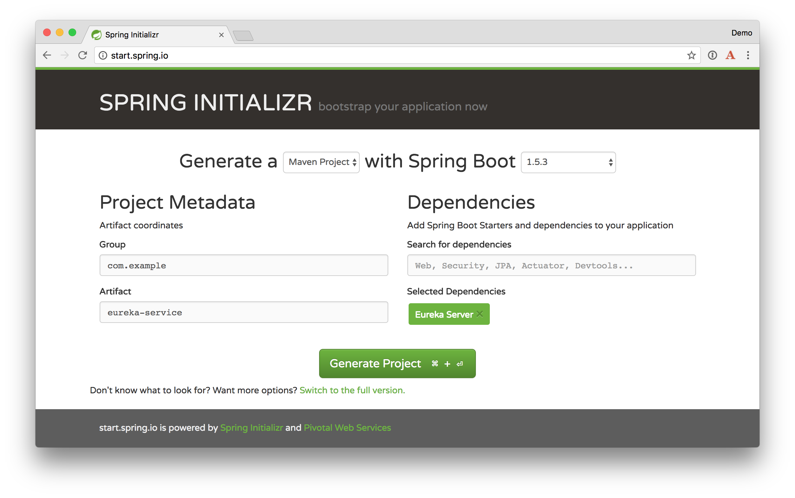
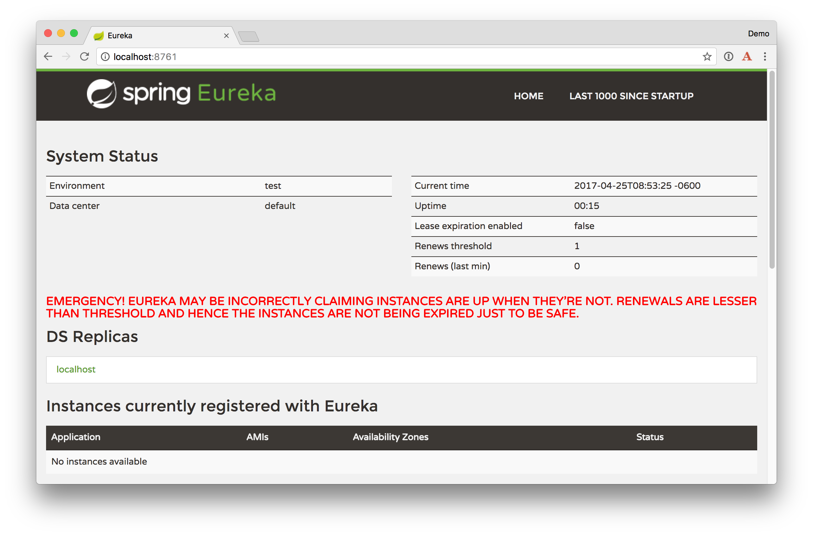
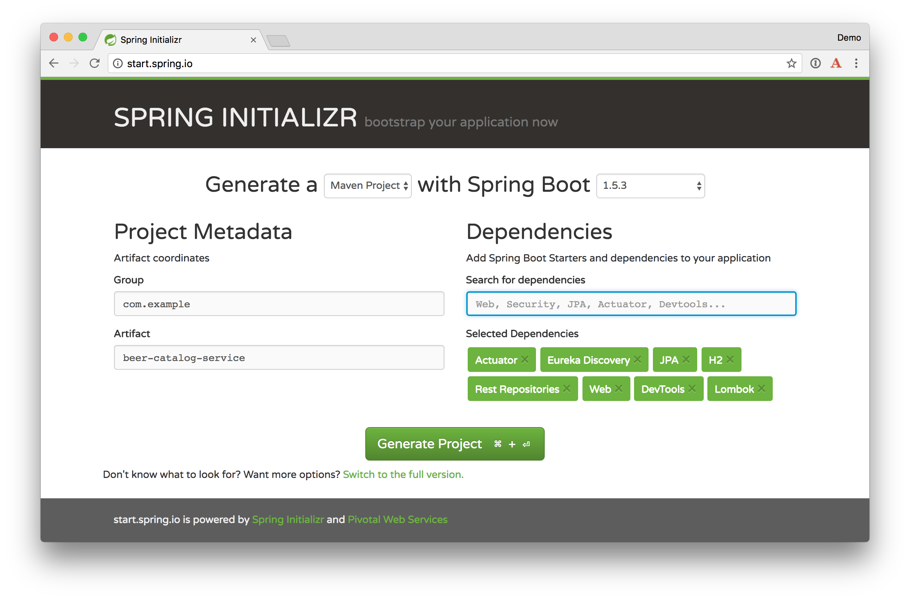
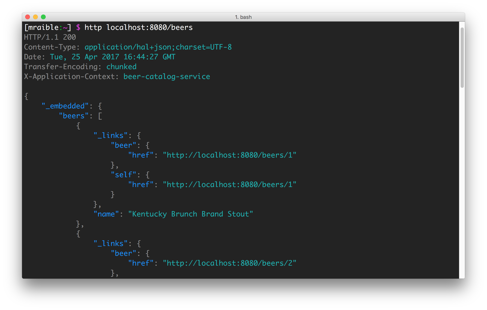
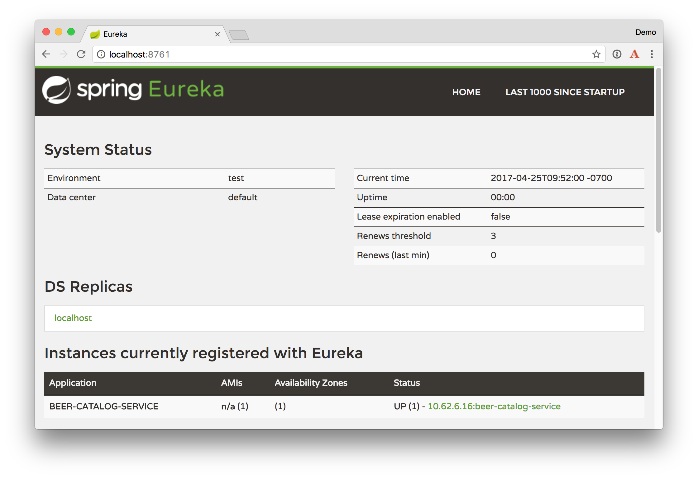
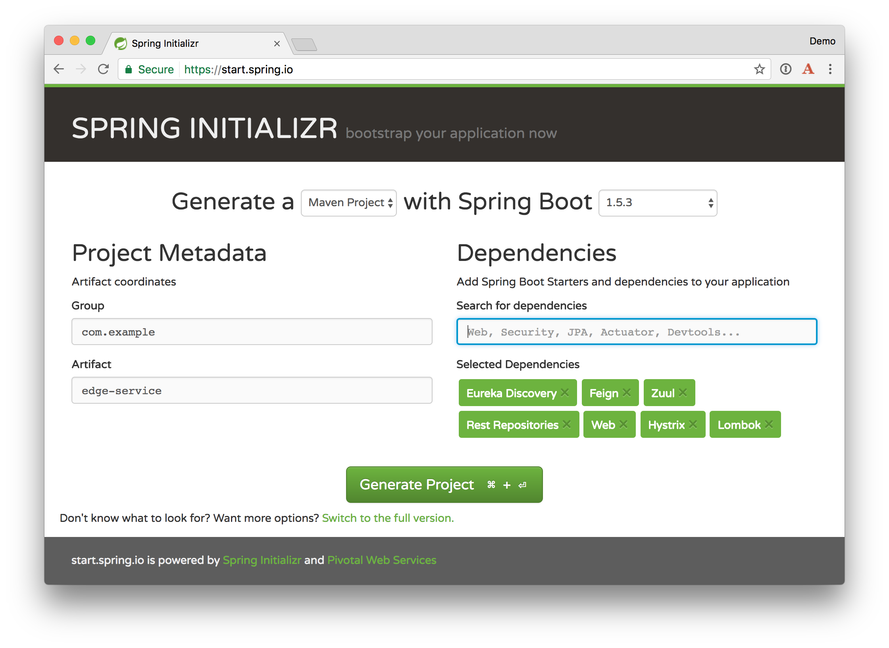
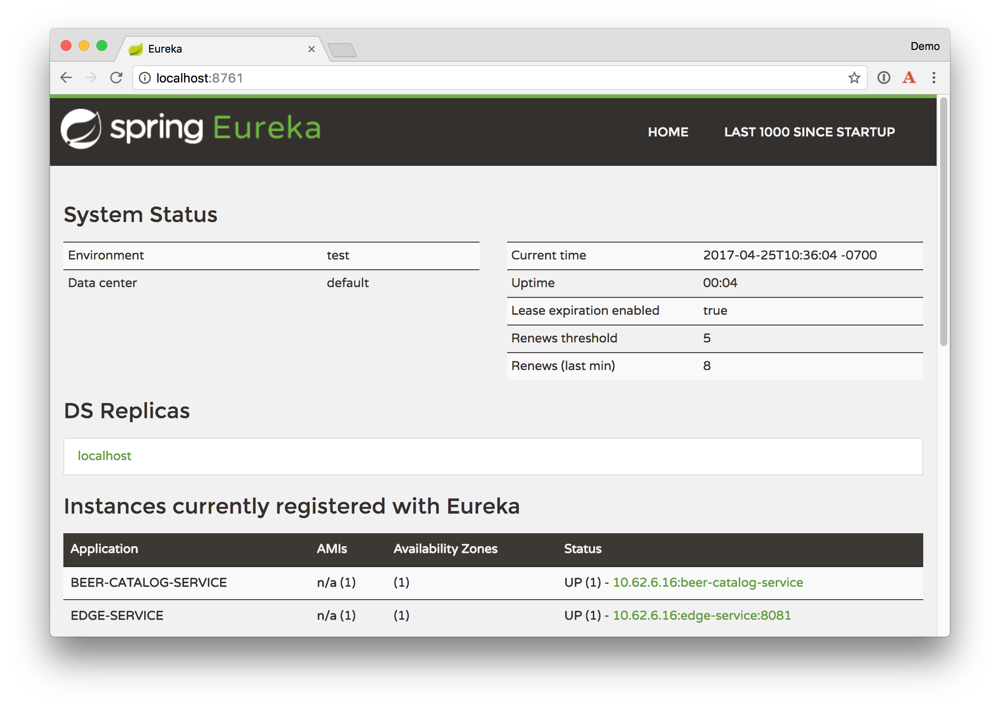
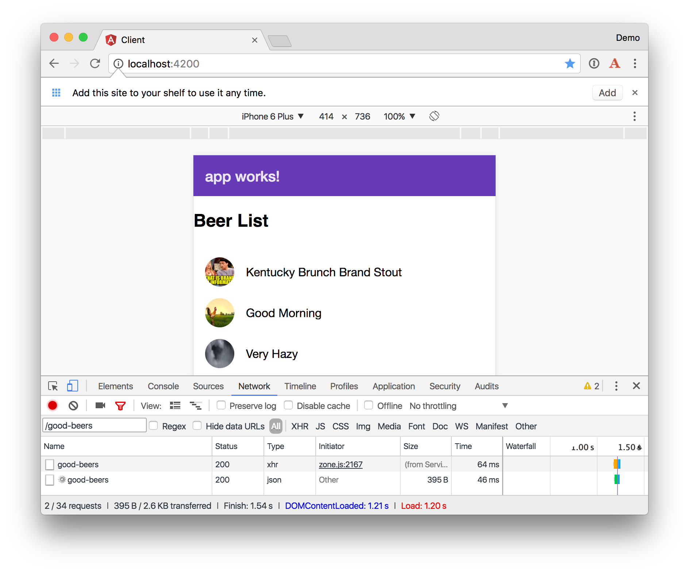

# Building a Microservices Architecture for Microbrews

Adopting and building a microservices architecture can be a good idea when you have a large team working on a single product. The product can likely be broken up into components that can function independently of one another. Once components can function independently, they can be built, tested, and deployed independently. This gives an organization and its teams the agility to develop and deploy very quickly.

In a [previous article], I showed you how to build a Spring Boot API with an Angular client. I then showed you how to convert 
the Angular app into a progressive web application that works offline. The Angular PWA is a good example of a resilient application
because it still works when connectivity fails. Did you know you can develop similar resiliency in your API with Spring Boot, Spring Cloud, and a microservices architecture? This article shows you how to convert the previously created Spring Boot application to use microservices. You'll create a beer catalog service, an edge service (for filter and displaying good beers), and a Eureka service that registers the services and allows them to communicate with one another.

Before we dive into coding, I'd like to talk a bit about microservices and their history.

## History of Microservices

According to [Wikipedia](https://en.wikipedia.org/wiki/Microservices#History), the term "microservice" was first used a
common architecture style at a workshop of software architects near Venice in May 2011. In May 2012, the same group
decided "microservices" was a more appropriate name.

James Lewis presented some of the ideas behind microservices in March 2012 at 33rd Degree in Kraków. His talk
was called Microservices - Java, the Unix Way. [Fred George](https://github.com/fredgeorge) is credited with for sharing
similar ideas at the same time.

[Adrian Cockcroft](https://www.linkedin.com/in/adriancockcroft), who was at Netflix at the time, describing this architecture
as "fine grained SOA". He pioneered the style at web scale, as did Joe Walnes, Dan North, Evan Bottcher and Graham Tackley.

Martin Fowler and James Lewis wrote an article titled simply [Microservices](http://martinfowler.com/articles/microservices.html)
on March 25, 2014. Years later, this is still considered the definitive article that defines microservices.

### Organizations and Conway's Law

Technology have traditionally been organized into technology layers: UI team, database team, operations team.
When teams are separated along these lines, even simple changes can lead to a cross-team project taking time and
budgetary approval.

A smart team will optimise around this and choose the lesser of two evils; forcing the logic into whichever application
they have access to. This is an example of [Conway's Law](http://www.melconway.com/Home/Committees_Paper.html) in action.


> Any organization that designs a system (defined broadly) will produce a design whose structure is a copy of the organization's communication structure.
> — Melvyn Conway, 1967

### Microservices Architecture Philosophy
The philosophy of a microservices architecture essentially equals to the Unix philosophy of "Do one thing and do it well". 
The characteristics of a microservices architecture are as follows:

* Componentization via Services
* Organized around Business Capabilities
* Products not Projects
* Smart endpoints and dumb pipes
* Decentralized Governance
* Decentralized Data Management
* Infrastructure Automation
* Design for failure
* Evolutionary Design

## Why Microservices?

It's easier to work on small "do one thing well" services. No single program represents the whole application, so services
can change frameworks (or even languages) without a massive cost. As long as the services use a language agnostic protocol (HTTP or lightweight messaging),
can application can be written in several different platforms - Java, Ruby, Node, Go, .NET, etc. - without issues.

Platform-as-a-Service (PaaS) providers and containers have made it easy to deploy microservices. All the technologies needed to support a monolith
(e.g. load balancing, discovery, process monitoring) are provided by the PaaS, outside of your container. Deployment effort becomes
close to zero.

### Are Microservices the Future?

Architecture decisions are usually only evident several years after you make them. Microservices have been successful
at companies like LinkedIn, Twitter, Facebook, Amazon, and Netflix. But that doesn't mean they'll be successful for
your organization. Component boundaries are hard to define. If you're not able to create your components cleanly,
you're just shifting complexity from inside a component to the connections between the components. Also, team
capabilities is something to consider. A poor team will always create a poor system.

> You shouldn't start with a microservices architecture. Instead begin with a monolith, keep it modular, and split it into microservices once the monolith becomes a problem.
> — Martin Fowler

## Build a Microservices Architecture with Spring Boot, Spring Cloud, and Netflix Eureka

Netflix Eureka is a REST-based service that is primarily used in the AWS cloud for locating services 
for the purpose of load balancing and failover of middle-tier servers. 

<!-- This paragraph is mostly lifted from the Spring Cloud project page. -->
[Spring Cloud](http://projects.spring.io/spring-cloud/) provides tools for developers to quickly build 
some of the common patterns in distributed systems (e.g. configuration management, service discovery, 
circuit breakers, intelligent routing, micro-proxy, etc.). Coordination of distributed systems leads to 
boiler plate patterns. Using Spring Cloud, developers can quickly stand up services and applications 
that implement those patterns. They will work well in any  distributed environment, including the 
developer's own laptop, bare metal data centres, and managed platforms such as Cloud Foundry.

[Spring Cloud Netflix](https://cloud.spring.io/spring-cloud-netflix/) provides Netflix OSS integrations
for Spring Boot applications. Patterns provided include Service Discovery (Eureka), Circuit Breaker (Hystrix), 
Intelligent Routing (Zuul) and Client Side Load Balancing (Ribbon).

To learn more about service discovery and resolution with Eureka, see Josh Long's 
[Microservice Registration and Discovery with Spring Cloud and Netflix's Eureka](https://spring.io/blog/2015/01/20/microservice-registration-and-discovery-with-spring-cloud-and-netflix-s-eureka).

### Create a Eureka Service

To begin, create a `spring-boot-microservices-example` directory. Navigate to [start.spring.io](https://start.spring.io). Enter `eureka-service` as an artifact name and select `Eureka Server`
as a dependency. 



Click the **Generate Project** button and expand `eureka-server.zip` into the `spring-boot-microservices-example` directory.

Modify `src/main/resources/application.properties` to add a port number disable registration.

```
server.port=8761
eureka.client.register-with-eureka=false
```

Open `src/main/java/com/example/EurekaServiceApplication.java` and add `@EnableEurekaServer`. 

```java
import org.springframework.cloud.netflix.eureka.server.EnableEurekaServer;

@EnableEurekaServer
@SpringBootApplication
```

This annotation, and the aforementioned properties, configures a registry that other applications can talk to.

Start the application from the command line using:

```bash
./mvnw spring-boot:run
```

Or if you're using Windows:

```bash
mvnw.bat spring-boot:run
```

After it starts, you should be able to open <http://localhost:8761> and see there are no 
services available.



### Create a Beer Catalog Service

Refresh [start.spring.io](https://start.spring.io) to start creating a new project. Use `beer-catalog-service`
for the artifact name and add the following dependencies:

* Actuator: features to help you monitor and manage your application
* Eureka Discovery: for service registration
* JPA: to save/retrieve data
* H2: an in-memory database
* Rest Repositories: to expose JPA repositories as REST endpoints
* Web: Spring MVC and embedded Tomcat
* DevTools: to auto-reload the application when files change
* Lombok: to reduce boiler-plate code



Click the **Generate Project** button and expand `beer-catalog-service.zip` into `spring-boot-microservices-example` and open the project in your favorite IDE. 
I recommend [IntelliJ IDEA](https://www.jetbrains.com/idea/) because it's great for Java and web development.

Create a `Beer` entity, a `JpaRepository` for it, and a `CommandLineRunner` to populate the database with default data. 
You can add this code to `BeerCatalogServiceApplication.java`, or create separate files for each class.

```java
@Data
@AllArgsConstructor
@NoArgsConstructor
@ToString
@Entity
class Beer {

    public Beer(String name) {
        this.name = name;
    }

    @Id
    @GeneratedValue
    private Long id;

    private String name;
}

@RepositoryRestResource
interface BeerRepository extends JpaRepository<Beer, Long> {}

@Component
class BeerInitializer implements CommandLineRunner {

    private final BeerRepository beerRepository;

    BeerInitializer(BeerRepository beerRepository) {
        this.beerRepository = beerRepository;
    }

    @Override
    public void run(String... args) throws Exception {
        Stream.of("Kentucky Brunch Brand Stout", "Good Morning", "Very Hazy", "King Julius",
                "Budweiser", "Coors Light", "PBR")
                .forEach(beer -> beerRepository.save(new Beer(beer)));

        beerRepository.findAll().forEach(System.out::println);
    }
}
```

Add an application name in `src/main/resources/application.properties` to display in the Eureka service.

```properties
spring.application.name=beer-catalog-service
```

Start the beer-catalog-service with Maven (`mvn spring-boot:run`) or your IDE.
 
At this point, you should be able to use [HTTPie](https://httpie.org/) to see the list of beers from the catalog service.

```bash
http localhost:8080/beers
```



However, if you open the Eureka Service at <http://localhost:8761>, you will not see the service registered. To register 
the beer-catalog-service, you need to add `@EnableDiscoveryClient` to `BeerCatalogServiceApplication.java`.

```java
import org.springframework.cloud.client.discovery.EnableDiscoveryClient;

@EnableDiscoveryClient
@SpringBootApplication
public class BeerCatalogServiceApplication {

    public static void main(String[] args) {
        SpringApplication.run(BeerCatalogServiceApplication.class, args);
    }
}
```

Re-compile this class, watch devtools restart your application, and return to <http://localhost:8761>. Now the service 
should show up.



<div style="border: 1px solid silver; padding: 10px 15px 0; border-radius: 4px; background: #eee">
<a name="intellij-auto-compile"></a>
<strong>Compile on Save in IntelliJ</strong><br>
<p>By default IntelliJ IDEA does not automatically compile files when the application is running. 
To enable the "Compile on save" feature:</p>
<ul>       
<li>Go to <strong>Preferences > Build, Execution, Deployment -> Compiler</strong> and enable "Build project automatically"
<li>Open the Action window:
<ul>
<li>Linux: CTRL+SHIFT+A</li>
<li>Mac: SHIFT+COMMAND+A</li>
<li>Windows: CTRL+ALT+SHIFT+/</li>
</ul>
</li>
<li>Enter <strong>Registry...</strong> and enable <code>compiler.automake.allow.when.app.running</code></li>
</ul>
</div>

### Create an Edge Service

The edge service will be similar to the standalone beer service created in [Bootiful Development with Spring Boot and Angular](TBD).
However, it will have fallback capabilities which prevent the client from receiving an HTTP error when the service is not available.

Navigate to [start.spring.io](https://start.spring.io) and create an "edge-service" application with the following dependencies:

* Eureka Discovery: for service registration
* Feign: a declarative web service client
* Zuul: provides intelligent routing
* Rest Repositories: to expose JPA repositories as REST endpoints
* Web: Spring MVC and embedded Tomcat 
* Hystrix: a circuit breaker to stop cascading failure and enable resilience
* Lombok: to reduce boiler-plate code



Click the **Generate Project** button and expand `edge-service.zip` into `spring-boot-microservices-example` and 
open the project in your favorite IDE. 

<!-- More info on Feign: https://blog.de-swaef.eu/the-netflix-stack-using-spring-boot-part-3-feign/ -->

Since the `beer-catalog-service` is running on port 8080, you'll need to configure this application to run on a different port.
Modify `src/main/resources/application.properties` to set the port to 8081 and set an application name.

```properties
server.port=8081
spring.application.name=edge-service
```

To enable Feign, Hystrix, and registration with the Eureka server, add the appropriate annotations to `EdgeServiceApplication.java`:

```java
import org.springframework.cloud.client.circuitbreaker.EnableCircuitBreaker;
import org.springframework.cloud.client.discovery.EnableDiscoveryClient;
import org.springframework.cloud.netflix.feign.EnableFeignClients;

@EnableFeignClients
@EnableCircuitBreaker
@EnableDiscoveryClient
@SpringBootApplication
public class EdgeServiceApplication {

    public static void main(String[] args) {
        SpringApplication.run(EdgeServiceApplication.class, args);
    }
}
```

Create a `Beer` DTO (Data Transfer Object) in this same file. Lombok's [`@Data`](https://projectlombok.org/features/Data.html)
will generate a `toString()` methods, getters, setters, and appropriate constructors.

```java
@Data
class Beer {
    private String name;
}
```

Create a `BeerClient` that uses Feign to talk to the `beer-catalog-service`.

```java
@FeignClient("beer-catalog-service")
interface BeerClient {

    @GetMapping("/beers")
    Resources<Beer> readBeers();
}
```

Create a `RestController` that filters out less-than-great beers and exposes a `/good-beers` endpoint.

**NOTE:** To get `beer.getName()` to work in your IDE, you may need to install the Lombok plugin. 

```java
@RestController
class GoodBeerApiAdapterRestController {

    private final BeerClient beerClient;

    public GoodBeerApiAdapterRestController(BeerClient beerClient) {
        this.beerClient = beerClient;
    }

    @GetMapping("/good-beers")
    public Collection<Beer> goodBeers() {
        return beerClient.readBeers()
                .getContent()
                .stream()
                .filter(this::isGreat)
                .collect(Collectors.toList());
    }

    private boolean isGreat(Beer beer) {
        return !beer.getName().equals("Budweiser") &&
                !beer.getName().equals("Coors Light") &&
                !beer.getName().equals("PBR");
    }
}
```

Start the `edge-service` application with Maven or your IDE and verify it registers successfully with the Eureka server.



You should be able to invoke the `/good-beers` endpoint as well.

```bash
$ http localhost:8081/good-beers
HTTP/1.1 200
Content-Type: application/json;charset=UTF-8
Date: Tue, 25 Apr 2017 17:37:50 GMT
Transfer-Encoding: chunked
X-Application-Context: edge-service:8081

[
    {
        "name": "Kentucky Brunch Brand Stout"
    },
    {
        "name": "Good Morning"
    },
    {
        "name": "Very Hazy"
    },
    {
        "name": "King Julius"
    }
]
```

This is cool, but if you shut down the `beer-catalog-service` application, you'll get a 500 internal server error.

```bash
$ http localhost:8081/good-beers
HTTP/1.1 500
Connection: close
Content-Type: application/json;charset=UTF-8
Date: Tue, 25 Apr 2017 17:40:32 GMT
Transfer-Encoding: chunked
X-Application-Context: edge-service:8081

{
    "error": "Internal Server Error",
    "exception": "java.lang.RuntimeException",
    "message": "com.netflix.client.ClientException: Load balancer does not have available server for client: beer-catalog-service",
    "path": "/good-beers",
    "status": 500,
    "timestamp": 1493142032310
}
```

To fix this, you can use Hystrix to create a fallback method and tell the `goodBeers()` method to use it.
 
 

```java
public Collection<Beer> fallback() {
    return new ArrayList<>();
}

@HystrixCommand(fallbackMethod = "fallback")
@GetMapping("/good-beers")
public Collection<Beer> goodBeers() {
```

Restart the `edge-service` and you should see an empty list returned.

```bash
$ http localhost:8081/good-beers
HTTP/1.1 200
Content-Type: application/json;charset=UTF-8
Date: Tue, 25 Apr 2017 17:44:18 GMT
Transfer-Encoding: chunked
X-Application-Context: edge-service:8081

[]
```

Start the `beer-catalog-service` again and this list should eventually return the full list of good beer names.

### Add an Angular PWA Client

You can copy the Angular PWA client I created in a [previous tutorial](TBD) and install its dependencies.

```bash
git clone git@github.com:oktadeveloper/spring-boot-angular-pwa-example.git
cp -r spring-boot-angular-pwa-example/client ~/spring-boot-microservices-example/.
cd ~/spring-boot-microservices-example/client
npm install
```

Then modify the `BeerService` in `src/app/shared/beer/beer.service.ts` to **use port 8081** instead of `8080`.

```typescript
getAll(): Observable<any> {
  return this.http.get('http://localhost:8081/good-beers')
    .map((response: Response) => response.json());
}
```

Modify `GoodBeerApiAdapterRestController` to allow cross-origin requests from any client.
 
```java
@GetMapping("/good-beers")
@CrossOrigin(origins = "*")
public Collection<Beer> goodBeers() {
```

Restart the `edge-service` and start the Angular client by running `npm start` in the client directory.

Open <http://localhost:4200> in your browser and verify that network calls to `/good-beers` go over port `8081`.



### Deploy to Cloud Foundry

In order to deploy the the `edge-service` and `beer-catalog-service` to Cloud Foundry, you need to add configuration files
so they work with Cloud Foundry's Eureka service.
 
Create `edge-service/src/main/resources/application-cloud.properties` and populate it with the following:

```properties
eureka.instance.hostname=${vcap.application.uris[0]:localhost}
eureka.instance.nonSecurePort=80
eureka.instance.metadataMap.instanceId=${vcap.application.instance_id:${spring.application.name}:${spring.application.instance_id:${server.port}}}
eureka.instance.leaseRenewalIntervalInSeconds = 5

eureka.client.region = default
eureka.client.registryFetchIntervalSeconds = 5
eureka.client.serviceUrl.defaultZone=${vcap.services.eureka-service.credentials.uri}/eureka/
```

Create `beer-catalog-service/src/main/resources/application-cloud.properties` and populate it with similar properties.

```properties
eureka.instance.hostname=${vcap.application.uris[0]:localhost}
eureka.instance.nonSecurePort=80
eureka.instance.metadataMap.instanceId=${vcap.application.instance_id:${spring.application.name}:${spring.application.instance_id:${server.port}}}
eureka.instance.leaseRenewalIntervalInSeconds = 5

eureka.client.region = default
eureka.client.registryFetchIntervalSeconds = 5
eureka.client.serviceUrl.defaultZone=${vcap.services.eureka-service.credentials.uri}/eureka/
```

To deploy it on Cloud Foundry with [Pivotal Web Services](http://run.pivotal.io/), you'll need to create an account,  
download/install the [Cloud Foundry CLI](https://github.com/cloudfoundry/cli#downloads), and sign-in 
(using `cf login -a api.run.pivotal.io`).
 
There are quite a few steps involved to deploy all the services and the Angular client for production. For that reason, 
I wrote a [`deploy.sh`](https://github.com/oktadeveloper/spring-boot-microservices-example/blob/master/deploy.sh) script 
that automates everything and uses random domain names for the backend services. Note that it uses a 
[`sw.py`](https://github.com/oktadeveloper/spring-boot-microservices-example/blob/master/sw.py) Python script to change 
the names of Angular's generated JavaScript files. 

## Learn More about Microservice Architectures

// TODO

// mention JHipster, Dropwizard, Tomitribe and MicroProfile


